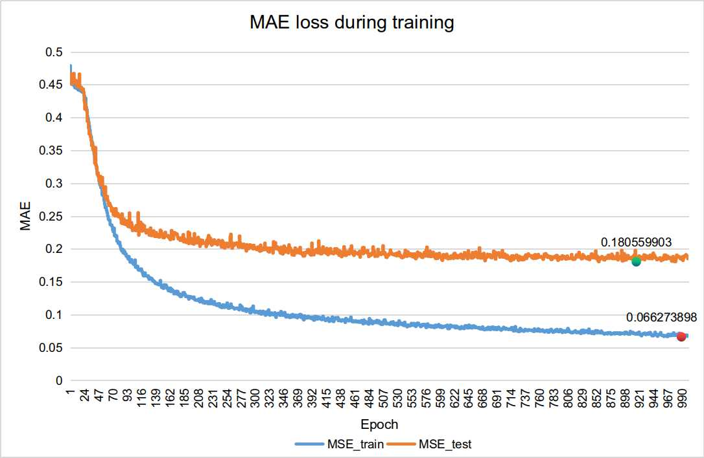
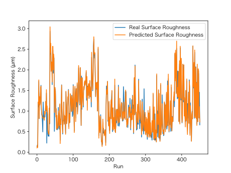

# Surface roughness investigations with deep learning technology

This is a projects which aims to monitor surface roughness of workpiece by machining signal

## Current step

+ build a high-accurate monitoring model 

## What we will do in the future

+ build a valid GAN model to simulate machining process
+ find the optimize machining parameters by search the tensor space of G network

## Notice

If you have any questions about my work, feel free to mail me.

Fork and pull request is welcomed.

# LICENCE

MIT LICENCE
